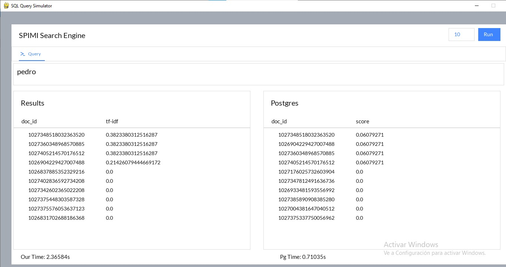
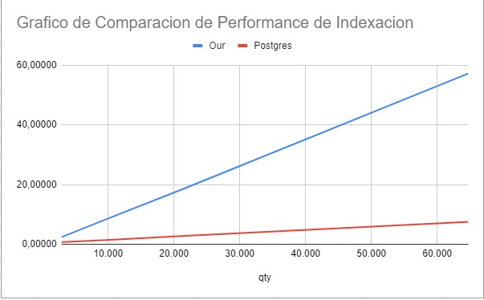
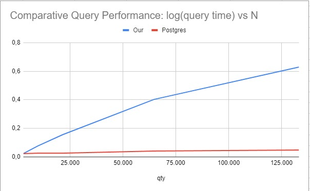

<br>
<p align="center">
    

<h3 align="center">SPIMI Search Engine</h3>

<p align="center">
    Single-Pass In-Memory Indexing for information search and recovery
</p>

#
<p align="center"


 


<p align="center"

The **SPIMI** *(Single-Pass In-Memory Indexing)* project is a simple implementation of an indexing algorithm used in information retrieval systems. This project aims to demonstrate the basic concepts of building an inverted index using the SPIMI algorithm as well as comparing query search times from our python index against SQL indexation.
</p>

## Features
- Building an inverted index from a collection of documents.
- Support for tokenization, stop word removal, and stemming.
- Indexation for search optimization.
- Visual Interface.
- We have merged multiple stoplists over the internet to make the best one possible.
- Querying the inverted index to retrieve relevant documents.
- Searches in both Postgres and our system.

### Prerequisites

To run the SPIMI index project, you need to have the following installed:
- Python (version 3.6 or higher)
- NLTK (Natural Language Toolkit) library
- Pygame (SDL wrapped library)
- Psycopg2 (Python to SQL connection)

### Installation

1. Clone the repository to your local machine:
```shell
git clone https://github.com/your-username/spimi-index-project.git
```

2. Install the required dependencies:
```sh
pip install -r requirements.txt
```

## Documents
The documents to be indexed are tweets collected from 07-08-2018 to 03-05-2018 provided to us by our instructor. The data was cleaned by reducing it to a collection of JSON files containing lists of structures of the form document text ("text") field and an id ("id") field. In total there are around 133 thousand entries in this dataset.


## Usage
1. Prepare your collection of documents in a suitable format (e.g., JSON files containing structures of the form {"id":id, "text": text-body}) and put them into the documents folder.

2. Update the ```main.py``` file with the appropriate configuration parameters and paths to your document collection.

3. Create an empty database in your postgreSQL and fill in line 13 in ```gui.py```:
   ```pg_querier = PG("<your-db-name>","<your-user>","<your-user-password>")```

4. Change the directory to the main location:

```sh
cd 'code'
```

5. Run the ```main.py``` script to run the program:

```sh
python main.py
```

6. After attempting the first search, the index is built automatically using the documents provided. You can perform queries on the indexed documents using the query interface.

<p align="center"></p>  

## Postgres configuration

Postgres was configured to use a GIN index over the tsvectors of the inserted text, thus allowing better query efficiency. The index is created after the data is loaded. Queries are conducted using tsvectors generated by the stripped version of the documents and the query, and ranked by the plain_to_tsvector() and rank() functions.
## Obtained Results

### Output values:

 You may find that the results emmited by Postgres and our method seldom match up. We are convinced this is because of the fact that the `rank()` function does not use any global information (https://www.postgresql.org/docs/current/textsearch-controls.html), and thus cannot be using the tf_idf method. Furthermore, term extraction on Postgres is fundamentally different that ours, due to our different stopword lists and the fact that Postgres´s tsvectors allow more granular access to information by pointing to where in a document a particular term is found. Finally, the `plain_to_tsquery()` function makes it so that the document has to match all the terms in the query prompt, while our implementation uses plain cosine distance.

### Indexing results

We were able to identify that both our and postgres´s index creation complexity is proportional to O(n). We notice however that postgres´s implementation is considerably more efficient. This is to be expected as our implementation is in python, and still leaves room for algorithmical improvement.

<p align="center"></p>  

### Querying Data

Postgres exhibits a very fast search performance against our solution. We can easily determine our data to signify a O(n) performance, but Postgres is difficult to identify. It would make theoretical sense, however that because of the GIN it would tend to k*log(n), k being the number of query terms and n the ammount of documents.

<p align="center"></p>  

# License
Distributed under the MIT license. See [`LICENSE`](./LICENSE) for more information.
