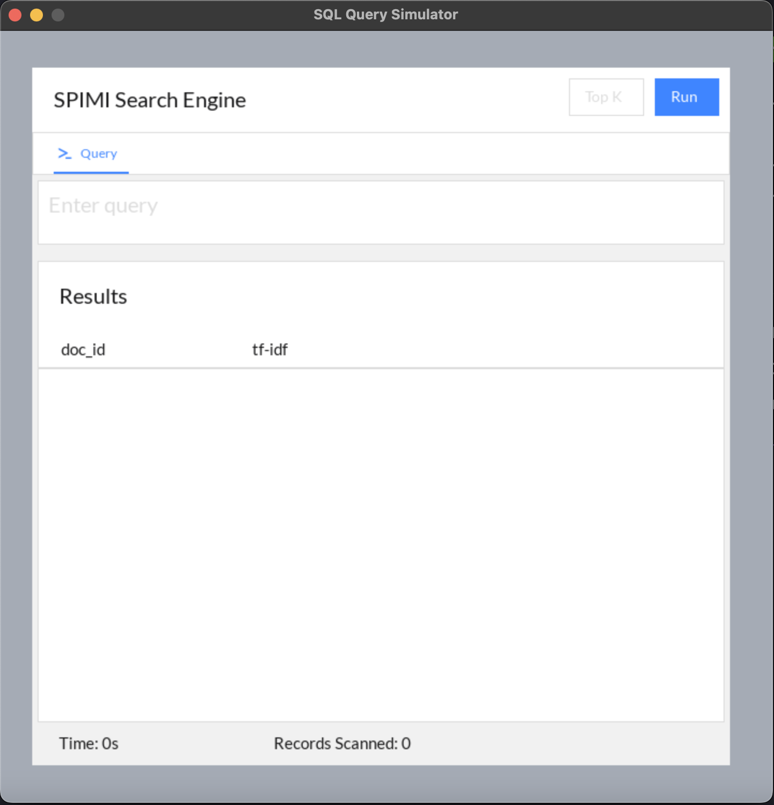

<br>
<p align="center">
    

<h3 align="center">SPIMI Search Engine</h3>

<p align="center">
    Single-Pass In-Memory Indexing for information search and recovery
</p>

#
<p align="center"


 


<p align="center"

The **SPIMI** *(Single-Pass In-Memory Indexing)* project is a simple implementation of an indexing algorithm used in information retrieval systems. This project aims to demonstrate the basic concepts of building an inverted index using the SPIMI algorithm as well as comparing query search times from our python index against SQL indexation.
</p>

## Features
- Building an inverted index from a collection of documents.
- Support for tokenization, stop word removal, and stemming.
- Indexation for search optimization.
- Visual Interface.
- We have merged multiple stoplists over the internet to make the best one possible.
- Querying the inverted index to retrieve relevant documents.
- SQL queries adapted from the NLP python ones. (creo)

### Prerequisites

To run the SPIMI index project, you need to have the following installed:
- Python (version 3.6 or higher)
- NLTK (Natural Language Toolkit) library
- Pygame (SDL wrapped library)
- Psycopg2 (Python to SQL connection)

### Installation

1. Clone the repository to your local machine:
```shell
git clone https://github.com/your-username/spimi-index-project.git
```

2. Install the required dependencies:
```sh
pip install -r requirements.txt
```

## Documents
Right now the documents include a summary of "The lord of the Rings: The Fellowship of the Ring" splitted in 5 parts and "The Maze Runner" entire book.

## Usage
1. Prepare your collection of documents in a suitable format (e.g., plain text files) and put them into the documents folder.

2. Update the ```main.py``` file with the appropriate configuration parameters and paths to your document collection.

3. Change the directory to the main location:

```sh
cd 'code'
```

4. Run the ```main.py``` script to run the program:

```sh
python main.py
```

5. After attempting a search, the index is built, you can perform queries on the indexed documents using the provided query interface.

<p align="center"></p>  

## Obtained Results


## License
Distributed under the MIT license. See [`LICENSE`](./LICENSE) for more information.
